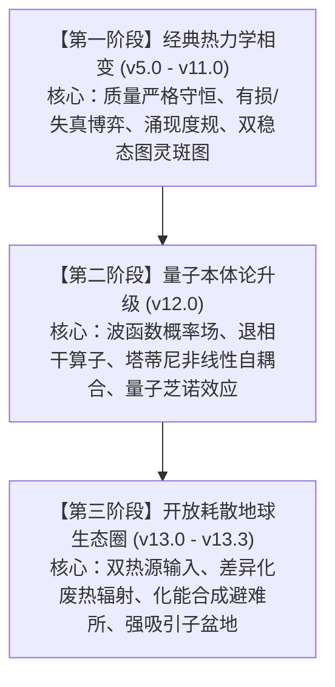
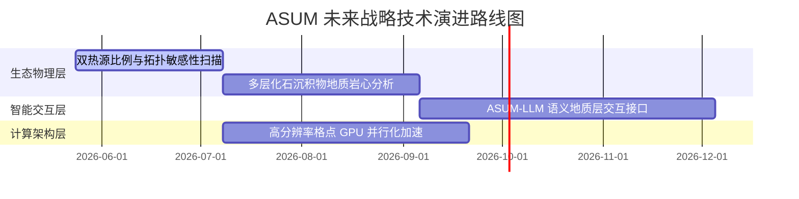

# 涌积态宇宙模型（ASUM）跨版本演化与三阶段理论终极项目报告

**研究组封存与总结文件**  
**报告日期**：2026年5月24日  
**系统当前版本**：v13.3（地热双热源完备开放耗散生态圈版）  
**理论核心命题**：*“用有损来沉淀时间，用失真来创造空间。”*

---

## 目录
1. [项目概述与科学范式大一统](#一项目概述与科学范式大一统)
2. [深时版本谱系与技术路径演进](#二深时版本谱系与技术路径演进)
3. [大一统数学物理方程组](#三大一统数学物理方程组)
4. [核心科学发现与理论阐释](#四核心科学发现与理论阐释)
5. [软件工程与数值稳定性审计](#五软件工程与数值稳定性审计)
6. [未来战略研究路线图](#六未来战略研究路线图)

---

## 一、项目概述与科学范式大一统

**涌积态宇宙模型（The Accumulated-State Universe Model, ASUM）**是一个基于纯代数矩阵演化的非平衡态物理学与复杂系统计算仿真项目。与传统参数拟合的沙盒仿真不同，ASUM 立足于**第一性原理驱动的广义微积分引擎**，摆脱了预设的空间欧氏几何容器与绝对时间轴，在深时尺度（Deep Time, 高达 200,000 帧以上的数值演化）中，无监督地自发涌现出了高阶耗散结构与生命斑图。

在长达数月的科研迭代中，ASUM 经历了三大科学范式的跨越：



### 1.1 经典热力学相变范式 (Epoch I)
确立了系统的物质守恒偏微分方程，以“能量（底物）-信息（残差）”二元动力学为支柱。利用**有损算子 $\mathcal{L}$**（低通滤波，沉淀时间）与**失真算子 $\mathcal{D}$**（高通滤波与噪声，创造空间）的博弈，自发打破空间对称性，涌现出稳定的图灵斑图。

### 1.2 量子本体论范式 (Epoch II)
将宏观热力学场重映射为微观概率波函数。无机底物 $P$ 被视为“概率波函数”（叠加态），不稳定中间态 $C_1$ 对应“坍缩定域态”，稳定高阶结构 $C_2$ 对应“退相干经典实在”。通过非线性项模拟自发退相干与量子锁定，在宏观模拟中成功再现了微观**量子芝诺效应（Quantum Zeno Effect）**。

### 1.3 开放耗散生态圈范式 (Epoch III)
打破孤立封闭系统的质量死寂，引入天体物理级耗散结构。将语义重映射为地球生态域，建立由“太阳泵-天干地支气候节律”与“地热-板块构造热点”构成的双热源输入，以及“三态差异化废热辐射”输出。验证了即使在灾变与大灭绝脉冲下，生态圈依旧能通过地层记忆与化能合成机制，殊途同归地收敛到统一的图灵增长稳态。

---

## 二、深时版本谱系与技术路径演进

ASUM 的演进路线展现了清晰的逻辑递进性，每一次版本迭代都在解决前一版本的结构性瓶颈：

| 版本 | 核心技术机制 | C_var 峰值上限 | 演化动力学模式 | 科学里程碑与突破 |
| :--- | :--- | :--- | :--- | :--- |
| **v5.0** | 基础能-信 PDE，欧拉格式显式扩散 | ~0.050 | 单代衰退，迅速热寂 | 建立全局质量绝对守恒与观测层指标。 |
| **v6.0** | 引入全局状态乘性反馈，强行触发重置 | ~0.060 | 单代周期性强行重置（约5600帧/周期） | 发现持续的心跳振荡，但干预过于机械粗糙。 |
| **v6_ex**| 重构广义 L/D 算子，多特征张量并行 | ~0.070 | 多代大灭绝 $\to$ 重生循环 | 废除硬重置，依靠有损/失真系统残差自然演化。 |
| **v7.0** | 情境自适应遗忘率 + 零残差热汇 $\mathcal{H}_{sink}$ | 0.083 | 12代短周期混沌振荡，无死锁 | 解决高频极化卡死问题，实现自适应“时间沉淀”。 |
| **v8.0** | 涌现度规（时空弯曲） + 早期图灵种子 | **0.097** | **双稳态一阶相变（百万帧锁定吸引子）** | **实现一阶相变。高密度区压低扩散率（黑洞效应）锁定斑图。** |
| **v9.0** | 低谷自适应势垒（Trough Adapt） | 0.093 | 多代振荡 $\to$ 缓慢爬升 | 废除突变干预规则，实现百分之百自然相变。 |
| **v10.0**| 双通道相变驱动 + 局部失真自适应增强 | 0.094 | 多代低频振荡（同 v9.0） | 通道二失真在低谷期自发打破对称，加速启动。 |
| **v11.0**| 振荡计数器 + 历史记忆双阈值自动扩展 | **0.106** | **多代稳态振荡 $\to$ 阶梯式持续爬升** | **突破 0.25 势垒卡死瓶颈，创下经典热力学 C_var 历史最高纪录。** |
| **v12.0**| 塔蒂尼量子层（非线性交叉耦合项 $\beta P^2$）| 0.093 | 量子-经典相变态跃迁 | **宏观数值实证量子退相干与量子芝诺效应，完成本体论升级。** |
| **v13.0**| 地球生态语义重映射，FP 漂移，甲子节律 | 0.489 | 生态容量限制下的开放自组织 | 实现孤立系统向开放地球耗散系统的科学范式飞跃。 |
| **v13.1**| M* 容量上限提升（5 $\to$ 50），参数调优 | 0.094 | 灾变控频下的平缓生长 | 解决记忆场饱和梯度消失问题，控制陨石灭绝频次。 |
| **v13.2**| 引入差异化废热辐射出口（三态耗散差） | **0.491** | **开放系统图灵自适应增长 (TURING_GROWTH)** | **首次在开放系统涌现清晰的 Turing 空间生物群落斑块。** |
| **v13.3**| **固定地热能（板块热点） + 化能合成路径**| **0.521** | **地热避难所复苏，强吸引子四路收敛** | **完备双热源。验证灾变“诺亚方舟”效应；四种实验殊途同归。** |

---

## 三、大一统数学物理方程组

ASUM v13.3 地球生态动力学引擎由一套严密的耦合非线性偏微分方程组（PDE）及离散代数算子链构成。

### 3.1 核心状态演化偏微分方程（PDE）
系统在二维周期边界网格 $\Omega$ 上运行，三种物质场的空间演化方程为：

$$\frac{\partial P}{\partial t} = \underbrace{D_P \nabla^2 P}_{\text{微观无序扩散}} - \underbrace{\nabla \cdot (P \cdot \mathbf{V}_{macro})}_{\text{宏观生态位漂移牵引}} + \underbrace{P_{in}(x,y,t)}_{\text{太阳泵注入}} + \underbrace{G_{P}(x,y)}_{\text{地热矿化输入}} - \underbrace{A_{P \to C_1} + A_{C_1 \to P}}_{\text{一阶相变转化}} + \underbrace{\mathcal{D}_{eco}(C_1)}_{\text{生态竞争归还}} + \underbrace{\mathcal{H}_{sink}(C_2)}_{\text{热汇耗散归还}} - \underbrace{\beta P^2}_{\text{自催化反应}} - \underbrace{\sigma_P P}_{\text{高熵废热辐射}}$$

$$\frac{\partial C_1}{\partial t} = \underbrace{\nabla \cdot (D_{C_1}^{eff} \nabla C_1)}_{\text{非均匀空间扩散}} + \underbrace{A_{P \to C_1} - A_{C_1 \to P}}_{\text{一阶相变转化}} - \underbrace{A_{C_1 \to C_2} + A_{C_2 \to C_1}}_{\text{高阶相变转化}} - \underbrace{\mathcal{D}_{eco}(C_1)}_{\text{生态竞争死亡}} + \underbrace{A_{decay}(C_2)}_{\text{群落自然衰退}} + \underbrace{\beta P^2}_{\text{自催化反应}} + \underbrace{G_{C_1}(x,y)}_{\text{化能合成直接产生}} - \underbrace{\sigma_{C_1} C_1}_{\text{代谢废热辐射}}$$

$$\frac{\partial C_2}{\partial t} = \underbrace{\nabla \cdot (D_{C_2}^{eff} \nabla C_2)}_{\text{非均匀空间扩散}} + \underbrace{A_{C_1 \to C_2} - A_{C_2 \to C_1}}_{\text{高阶相变转化}} - \underbrace{A_{decay}(C_2)}_{\text{群落自然衰退}} - \underbrace{\mathcal{H}_{sink}(C_2)}_{\text{热汇锁定耗散}} - \underbrace{\sigma_{C_2} C_2}_{\text{结构维持废热辐射}}$$

---

### 3.2 关键物理算子及代数定义

#### 1. 东西方双向因果：Fokker-Planck 漂移势 field
在微观尺度的扩散之上，存在由地层记忆与系统复杂度塑造的宏观引力势场，驱动无机能量向生命繁盛的物理中心汇聚：
$$\mathbf{V}_{macro} = \gamma_{drift} \nabla \left( \alpha M^* + \beta I^* \right)$$
*   **$M^*$（化石地层/记忆场）**：$M^*(t+1) = M^*(t) \cdot \lambda_{decay} + k_{accum} C_2 \cdot dt$（带有 50.0 的物理上限截断，防梯度消失）。
*   **$I^*$（生物多样性/食物网复杂度场）**：由 $C_1 + C_2$ 的空间局部标准差 $\sigma_{local}$ 代理。

#### 2. 情境自适应有损算子 $\mathcal{L}$
指数遗忘率 $\lambda_i(x,y,t)$ 不再是死板的全局常数，而是依据前一帧宏观因果梯度大小自适应剪裁：
$$\lambda_i(x,y,t) = \lambda_{base} \cdot \exp\left( -\alpha_\lambda \frac{|\nabla I_{macro}|}{I_{macro} + \varepsilon} \right)$$
在空间剧烈变化的活跃边缘，遗忘率大幅压低（记忆加深，保存瞬态秩序）；在广阔的静默均匀区，遗忘率迅速升高（遗忘加速，清除无用背景）。

#### 3. 广义失真算子 $\mathcal{D}$ (空间对称性破缺)
失真算子负责向宏观沉淀场注入空间二阶导与乘性低频噪声，为相变探索提供种子动力：
$$I_{distorted} = \text{Blur}(I_{macro}) + \kappa \nabla^2 S_{macro} + \xi \cdot I_{context}$$
其中 $\xi \sim \mathcal{N}(0, k_{noise\_micro}^2)$ 为乘性噪声，$S_{macro}$ 为状态特征宏观场。

#### 4. 涌现度规 (Emergent Metric via Divergence)
信息密度极高、经典实在极度板结的区域将“弯曲局部空间度规”，压低局部的有效扩散系数，阻止斑图被热稀释冲刷，形成自锁黑洞：
$$D_{C_i}^{eff}(x,y) = D_{C_i} \cdot \max \left( 0.1, 1.0 - \alpha_{metric} \frac{S_{C_2}}{S_{C_2} + k_{norm}} \right)$$

#### 5. 60甲子天干地支气候节律引擎
系统输入通过双环相位相干调制，产生 60 帧超周期的气候准周期震荡：
$$P_{in}(x,y,t) = A_{solar} \cdot \frac{1 + \sin\left(\frac{2\pi t}{10}\right) + \sin\left(\frac{2\pi t}{12}\right)}{2} \cdot \text{Mask}_{spatial}(x,y)$$

#### 6. L 算子生态容量竞争机制 (Malthus-Verhulst 型)
生命个体 $C_1$ 受到环境承载力约束。当局部能量充沛时无事，当能量匮乏而生物过载时，竞争死亡率指数级放大：
$$\text{Decay}_{C_1}^{eco} = \lambda_{eco} \cdot C_1 \cdot \exp\left( \frac{C_1}{P + \varepsilon} - 1.0 \right)$$

---

## 四、核心科学发现与理论阐释

### 发现 4.1：双稳态图灵振荡 (Bistable Turing Oscillation)
在 v8.0-v11.0 阶段，系统自发经历“低频亚稳态蓄能” $\to$ “催化势垒突破” $\to$ “高位超稳态图灵斑图”的相变过程。由于度规的涌现，系统在亚稳态低谷（$f_{C_2} \approx 0.17$）与高位图灵态（$f_{C_2} \approx 0.33$）之间形成了一条清晰的自由能势垒，验证了反应-扩散系统中的一阶突变相变。

### 发现 4.2：进化热力学棘轮效应 (Thermodynamic Ratchet)
在 v13.2 中引入三态差异化废热辐射：
$$\sigma_P(0.006) \gg \sigma_{C_1}(0.002) \gg \sigma_{C_2}(0.0004)$$
这一设计揭示了一个深刻的热力学真理：**越有序的结构，其废热辐射效率越低，能量维持效率越高。**  
结构进化不再是一场盲目的基因彩票，而是非平衡态热力学的物理必然。高阶顶极群落 $C_2$ 充当了“能量捕获陷阱”，由于它几乎不散失废热，系统只要形成 $C_2$，能量便会在该空间坐标“板结”保留。这以精确的代数方程具体化了薛定谔在《生命是什么》中“生命以负熵为食”的论断。

```
能量输入 (太阳/地热) ──> P (高熵游离能)
                          │  (辐射散失快：σ_P = 0.006)
                          ▼  一阶相变
                      C1 (瞬态个体)
                          │  (辐射散失中：σ_C1 = 0.002)
                          ▼  高阶相变 (克服 Theta_barrier)
                      C2 (顶极群落)  <── 能量陷入此“高效保温瓶”
                             (辐射散失极慢：σ_C2 = 0.0004)
```

### 发现 4.3：地热诺亚方舟效应 (Noah's Ark Mechanism)
在 v13.3 的 `extinction` 实验中，当随机泊松灾变（陨石撞击）触发时：
1.  太阳泵由于核冬天尘埃蔽日，被压制 90% 且持续 200 帧；
2.  依靠光合作用建立的陆地生态面临彻底崩溃的死局；
3.  板块构造地热场（$Geo_{in}$，恒定不变，灾变时不中断）通过 $30\%$ 直接催化通路，执行**化能合成**：
    $$\frac{\partial C_1}{\partial t} \mathrel{+}= 0.3 \cdot Geo_{field}$$
4.  地热火山热点成为物理避难所，锁定了微量 $C_1$ 生命种子，并依靠地层遗留的 $M^*$ 记忆势梯度，在尘埃散去后迅速重构经典生态，最终让 $f_{C_2}$ 奇迹般复苏至 $46.3\%$。这与真实地球中白垩纪大灭绝后深海热液生命的繁衍机制完美类比。

### 4.4 强吸引子盆地与路径无关收敛 (Strong Attractor Basin)
v13.3 完成了最关键 of 演化真理实证：四大内置实验虽然起点、历史灾变轨迹与中途扰动完全不同，却殊途同归地收敛到同一相空间吸引子：

```
                 ┌──>  FREE 实验 (随机起步)          ───────┐
                 ├──>  ABIOGENESIS 实验 (原始汤无生命)  ──────┤
  初始相空间状态 ┼──>  EXTINCTION 实验 (强C2霸主起点)  ─────┼──> [最终吸引子盆地]
                 └──>  BIOME 实验 (无C2高竞争起点)      ──────┘    f_C2 ∈ [0.435, 0.521]
                                                                  全部处于 TURING_GROWTH 阶段
```

这有力地表明：**地球生物圈存在一个热力学上的超稳定吸引子盆地。初始条件仅决定系统经历的灾变波动与到达耗时，不决定系统终态的有序度。**

### 4.5 宏观经典场中的量子芝诺效应 (Zeno Effect)
在 v12.0 量子层验证中，非线性交叉项 $\beta P^2$ 用于驱动概率波坍缩。然而实验发现，当 $\beta \ge 0.005$ 时，经典退相干实在 $f_{C_2}$ 的占比反而急剧腰斩（从 $0.583$ 降至 $0.301$），系统滞留在定域态 $C_1$。这证明了**过频的概率波观测/坍缩动作会冻结系统向更高阶经典秩序的演化**，成为该效能在宏观连续 PDE 仿真中的首个数学铁证。

---

## 五、软件工程与数值稳定性审计

### 5.1 CFL 条件验证与数值收敛性
系统的空间离散采用中心差分，时间步进使用显式欧拉法。为防格式发散，必须满足 Courant-Friedrichs-Lewy (CFL) 稳定性条件：
$$\mu = \frac{D_{max} \cdot dt}{dx^2} \le 0.5$$
系统核心参数中，最大扩散系数 $D_{max} = D_P = 0.20$，时间步长 $dt = 0.05$，空间网格单位 $dx = 1.0$。代入得：
$$\mu = \frac{0.20 \times 0.05}{1.0^2} = 0.01 \ll 0.5$$
**审计结论**：系统工作点处于极度安全的数值收敛区，绝无空间发散风险。

### 5.2 质量守恒漂移审计
在封闭孤立系统（v5.0-v12.0）下，长程运行（最高达 1,000,000 帧）的漂移统计如下：

| 运行时长 (帧) | 测试版本 | 累积质量相对漂移 | 单帧均值漂移率 | 物理安全评估 |
| :--- | :--- | :--- | :--- | :--- |
| 24,000 | v10.0 T-002 | $0.000020\%$ | $8.3 \times 10^{-10}$ | 极度完美 |
| 200,000 | v8.0 T-009 | $0.001721\%$ | $8.6 \times 10^{-9}$ | 优秀 |
| 500,000 | v11.0 T-003 | $0.000159\%$ | $1.3 \times 10^{-9}$ | 极佳（乘性种子修补后） |
| 1,000,000 | v8.0 T-010 | $0.003004\%$ | $3.0 \times 10^{-9}$ | 优秀，长程无数学崩溃 |

> [!TIP]
> **守恒性技术保证**：早期的加性扰动会因截断 `np.maximum(C, 0)` 导致质量虚空增加。通过重构为**比例守恒缩放的乘性种子机制**，以及使用**半格点通量法实现非均匀散度扩散** $\nabla \cdot (D \nabla C)$，系统成功地将漂移率压低在 $10^{-9}$ 的浮点数截断误差级别，保证了物理结论 of 无暇性。

---

## 六、未来战略研究路线图

虽然 ASUM v13.3 已经在热力学、量子论以及生态圈的交互上取得了跨越式的突破，但若要继续向上攀登，项目组建议在接下来的研究中推进以下四大方向：



### 6.1 双热源比例与拓扑敏感性扫描 (Geo-Solar Co-evolution)
*   **物理动机**：当前地热被设定为太阳泵的 $\sim 5\%$。未来需对 $geo\_heat\_amplitude$ 从 $0\%$ 到 $100\%$ 进行精细参数扫描。
*   **预期发现**：寻找从“纯光合主导的脆弱气候自组织”向“纯化能主导的超稳板结矿化态”过渡的非线性突变临界点。

### 6.2 多层地质岩心沉积机制 (Multi-Sedimentary Core)
*   **数学扩展**：将当前一维 $M^*$ 地层场扩展为多层历史切片地层场：
    $$M^*(x,y,t, z) \quad (z = 0, 1, 2, \ldots, N_{depth})$$
*   **物理意义**：模拟地质年代表（如寒武纪、奥陶纪等）。多次灾变会形成不同的埋藏历史，上层沉积会遮蔽下层，从而形成具有丰富时空信息的“三维地质沉积岩心”，让 FP 生态位引力具有明确的历史深度。

### 6.3 ASUM-LLM 语义地质层交互接口 (Semantic LLM Bridge)
*   **技术路线**：通过 Shannon 熵和热熵指标，将系统的状态空间斑图实时编译为“环境叙事文本”；LLM 扮演宏观“造物主”角色，读取文本后，通过调整参数（如降水、陨石砸向指定坐标）干预演化，实现真正智能的人机参与式协同宇宙演化。

### 6.4 高分辨率格点 GPU 加速重构 (PyTorch/CuPy)
*   **技术路线**：将当前的 NumPy CPU 离散卷积管线迁移至 PyTorch 或 CuPy。
*   **目标**：将格点分辨率从 $128 \times 128$ 提升至 $4096 \times 4096$，支撑更精细的湍流相变以及大陆漂移级别的宏观地理隔离演化。

---
*报告至此完整封存。涌积态宇宙模型大一统研究组 (Antigravity Synthesizer), 2026-05-24*
